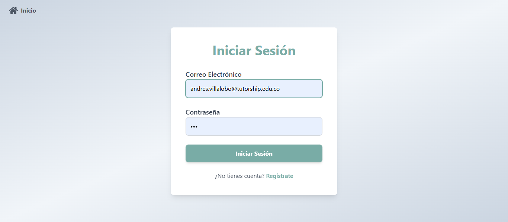
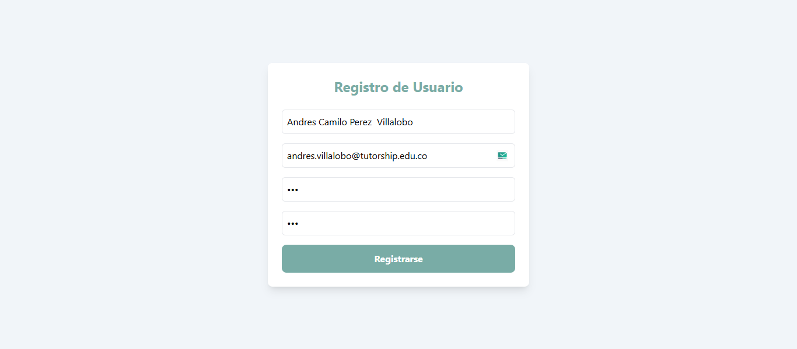
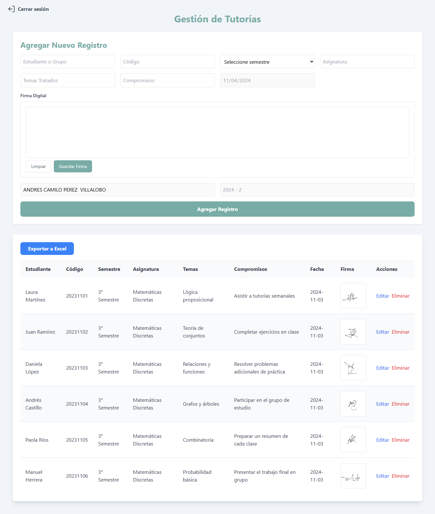
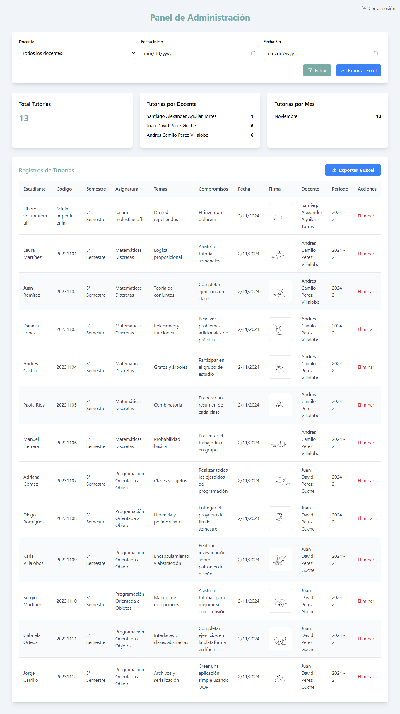
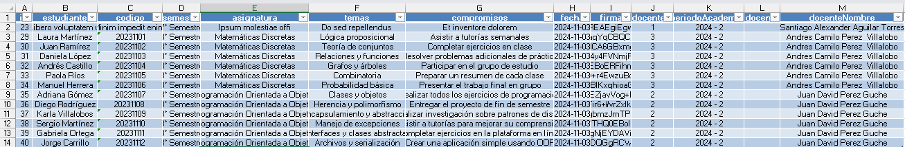

# Sistema de Gestión de Tutorías Online

## Autores

- [Santiago Alexander Aguilar Torres]

## Descripción

Sistema web para la gestión y seguimiento de tutorías académicas, desarrollado con React y Node.js. Permite a docentes y administradores gestionar registros de tutorías, incluyendo firmas digitales y exportación de datos.

### Icono del Proyecto


## Características Principales

- 🔐 Autenticación de usuarios (docentes y administradores)
  
### Inicio de sesión



### Registro de usuarios



- 📝 Registro de tutorías con firma digital
  
### Gestión de tutorías



- 📊 Panel de administración con estadísticas
  
### Administración de tutorías



- 📥 Exportación de registros a Excel
  
### Tabla exportada de Excel



- 🎨 Interfaz moderna y responsive con Tailwind CSS

## Tecnologías Utilizadas

### Frontend

- React 18
- Vite
- Tailwind CSS
- React Router DOM
- Axios
- React Signature Canvas
- XLSX para exportación de datos

### Tecnologías Backend

- Node.js
- Express
- MySQL
- Sequelize ORM
- JWT para autenticación
- bcryptjs para encriptación

## Estructura del Proyecto

```plaintext
proyecto/
├── client/                 # Frontend React
│   ├── src/
│   │   ├── pages/         # Componentes de páginas
│   │   ├── App.jsx        # Componente principal
│   │   └── main.jsx       # Punto de entrada
│   └── public/            # Archivos estáticos
└── server/                # Backend Node.js
    ├── server.js          # Servidor Express
    └── models/            # Modelos Sequelize
```

## Requisitos Previos

- Node.js (v14 o superior)
- MySQL
- npm o yarn

## Instalación

### Backend

```bash
cd server
npm install
```

### Frontend

```bash
cd client
npm install
```

## Configuración

### Base de Datos

1. Crear una base de datos MySQL llamada `tutorias_db`
2. Configurar las credenciales en `server/server.js`:

```javascript
const sequelize = new Sequelize('tutorias_db', 'usuario', 'contraseña', {
    host: 'localhost',
    dialect: 'mysql'
});
```

## Ejecución

### Backend

```bash
cd server
npm start
```

### Frontend

```bash
cd client
npm run dev
```

## Funcionalidades

### Módulo de Autenticación

- Registro de nuevos docentes
- Inicio de sesión
- Gestión de sesiones con JWT

### Panel de Usuario (Docente)

- Registro de tutorías
- Firma digital
- Visualización de registros propios
- Exportación a Excel

### Panel de Administración

- Visualización de todas las tutorías
- Estadísticas generales
- Gestión de usuarios
- Exportación de datos

## Seguridad

- Autenticación mediante JWT
- Contraseñas encriptadas con bcrypt
- Validación de rutas protegidas
- Manejo de roles (admin/docente)

## Contribución

1. Fork del repositorio
2. Crear rama para nueva funcionalidad (`git checkout -b feature/nueva-funcionalidad`)
3. Commit de cambios (`git commit -am 'Añadir nueva funcionalidad'`)
4. Push a la rama (`git push origin feature/nueva-funcionalidad`)
5. Crear Pull Request

## Licencia

Este proyecto está bajo la Licencia GNU GPL v3. Esto significa que:

- ✅ Puedes usar este código para cualquier propósito, incluyendo proyectos comerciales.
- ✅ Puedes modificar el código según tus necesidades.
- ✅ Puedes distribuir versiones modificadas del código.
- ⚠️ DEBES mantener el código fuente abierto y disponible.
- ⚠️ DEBES distribuir tu software derivado bajo la misma licencia (GNU GPL v3).
- ⚠️ DEBES indicar los cambios significativos realizados al código.
- ❌ NO puedes incorporar este código en software propietario/cerrado.

Para más detalles, consulta el archivo [LICENSE](./LICENSE) en este repositorio o visita [GNU GPL v3](https://www.gnu.org/licenses/gpl-3.0.html).

### Atribución

Si utilizas este software, por favor incluye una atribución a los autores originales:

## Contacto

Para preguntas o sugerencias, por favor contactar a cualquiera de los autores listados arriba.

**Nota**: Asegúrate de configurar las variables de entorno apropiadamente antes de ejecutar en producción.
